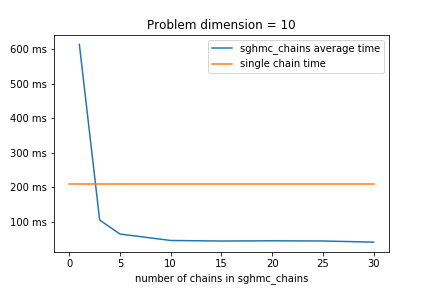
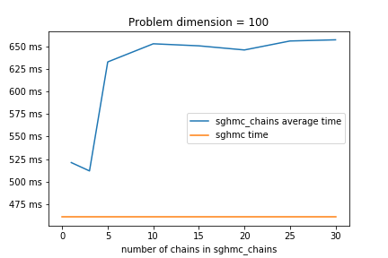
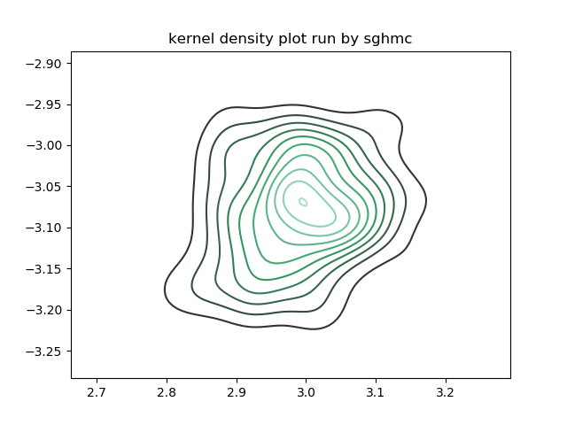
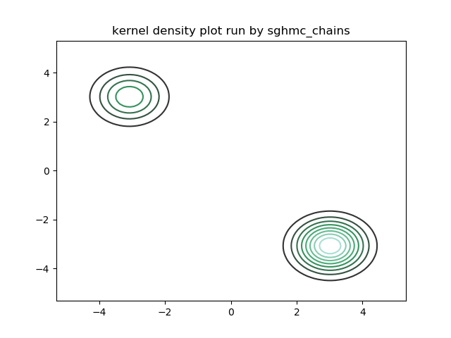
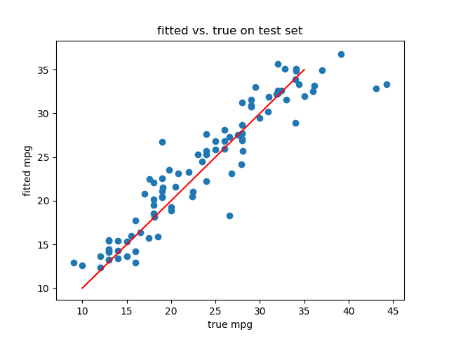
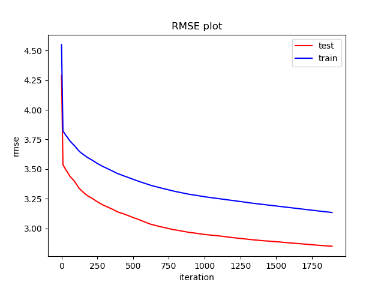

# An implementation of Stochastic Gradient Hamiltonian Monte Carlo in python

### Abstract

We implement the SGHMC described in paper Stochastic Gradient Hamiltonian Monte Carlo by Chen et al (2014). This specific HMC largely decreases the computation complexity by applying a stochastic gradient calcuted on minibatchs of data with noise and counterbalances that noise by a friction term. We implemented the algorithm in python, and tested optimizations utilizing ```numba```, ```cppimport``` and ```multiprocess```. We test the behavior of SGHMC on two examples compared to other two MCMC methods.One of them is the normal HMC from pyhmc package, and the another one is from pystan package.There is an up-to-date [Github repository](https://github.com/Senlody/SGHMC). The instruction of installation and explaination of function will be avaliable in README file. 

key words: hamiltonian, monte carlo, stochastic, minibatch, hmc, mcmc

### Introduction

Hamiltonian Monte Carlo (HMC) (Duane et al., 1987; Neal, 2010) is an advanced Markov Chain Monte Carlo (MCMC) sampling method. Rather than using a traditionally statistical way to find a proposal distribution, HMC introduce the definition of potential energy and kinetic energy from physics to find a proposal distribution. However, there is a limitation for HMC, which is the requirement to compute the gradient of the potential energy function during a sampling process. This problem could be addressed when the data size is small. Nonetheless, with the increasing data size in real world analysis, calculating the gradient of potential energy for whole dataset is very costly and time consuming. In order to address the weakness in HMC, the paper Stochastic Gradient Hamiltonian Monte Carlo by Chen et al (2014) develops an advanced version of HMC to sidestep the inner limitation.Stochastic Gradient Hamiltonian Monte Carlo (SGHMC) works the same way as HMC but is different from their inner computation. Instead of calculating the gradient of potential energy function for whole dataset, SGHMC applies a stochastic gradient on minibatches of data with a certain degree noise and then counteracts that noise with a “friction” term.

SGHMC can be appliled in any situation where MCMC methods are needed and it also takes advantage of producing low correlation samples during the sampling procedure, while also decreasing the computation cost especially when data size is large. This allows a more efficient exploration in the state space. One limitation of SGHMC is that users need to approximate many variables initially compared to other algorithms and different setups may lead to different target distributions. Another limitation is that the stochastic gradient calculated based on minibatches of data may be inappropriate since the observation size is not enough.

### Algorithm Description

The derivation of SGHMC is very complex. Let us start from the basic HMC formula. With the help of auxiliary variables in physics system, the Hamiltonian function is defined by:

$$
H(\theta,r)=U(\theta)+\frac{1}{2}r^{T}M^{-1}r^{-T}
$$

Where $U(\theta)$ is the potential energy defined by $U(\theta)=-\sum_{x \in D}logp(x|\theta)-logp(\theta)$ given a set of independent obervations $x \in D$ while r and mass matrix M together define the kinectic energy term. Then, the unit change in $\theta$ and $r$ is:

\begin{align}
d\theta &= M^{-1}rdt \\
dr &= -\nabla U(\theta)dt
\end{align}

SGHMC introduces a stochastic gradient based on minibatch of data $\tilde D$ with noise into system and counterbalance that noise by a friction term. Then the stochastic gradient is defined by $\nabla \tilde{U}(\theta)=-\frac{|D|}{|\tilde{D}|}\sum_{x \in \tilde{D}}\nabla logp(x|\theta)-\nabla logp(\theta)$. SGHMC is based on the assumption that $\nabla \tilde{U}(\theta)$ follows a normal distribution $\nabla \tilde{U}(\theta) = \nabla U(\theta) + N(0,V(\theta))$, where $V(\theta)$ is the covariane of stochastic gradient noise. SGHMC introduces an altered HMC procedure to counteract the noise term, in which the unit change in $\theta$ and $r$ is defined by:

\begin{align}
d\theta&=M^{-1}rdt \\
dr&=-\nabla U(\theta)dt-BM^{-1}rdt+N(0,2Bdt)
\end{align}

For simplicity, $B(\theta)$ is abbreviated to $B$. $N(0,2Bdt)$ is the noise approximated by a normal distribution where $B(\theta)=\frac{1}{2}\epsilon V(\theta)$ is the defusion matrix contributed by gradient noise. $\epsilon$ is the step size, and it takes similar function with learning rate in gradient descent. Thus, it is a very small number. $-BM^{-1}rdt$ is the friction term. However, in practice we rarely know the exact noise model $B$. We use $\hat{B}$ instead to approxiamte noise model. As a result, a new friction term $C\succeq \hat{B}$ is introduced. The new equation of dr is:

$$
dr=-\nabla U(\theta)dt-CM^{-1}rdt+N(0,2(C-\hat{B})dt)+N(0,2Bdt)
$$

Finally,the algorithm is:

initialize $(\theta_0, r_0,\epsilon, M,\hat{B},B,C)$

when t=1,2,3......

\begin{align}
\theta_i&=\theta_{i-1}+\epsilon_tM^{-1}r_{i-1}\\
r_i&=r_{i-1}-\epsilon_t \nabla \tilde {U}(\theta_i)-\epsilon_t CM^{-1}r_{i-1}+N(0,2(C-\hat{B})\epsilon_t)
\end{align}

## Optimization


In order to perform SGHMC in various of problems, the implementation should take functions as arguments to compute gradients of log density functions for various of problems. We intend to enable users to write their own custormized gradient functions in python, and pass them into our sghmc function.

The algorithm itself is simple. First, the function takes in user specified gradient functions together with data, initial guess and other parameters in the algorithm. Then iterate the sampling process, during which the main computation is the gradients and matrices products. 

Our first implementation is vectorized utilizing numpy matrices. Based on the numpy version, we also tried several optimizations:

- Precompilation of gradient functions. When profiling the algorithm, we found that the computation of gradient functions takes a large part in total time. Thus the first optimization we tried is to pass in numba compiled gradient functions.

- Rewriting matrices computation in c++: Another heavy computation we identified is updating $r$, which involves several matrices products that will be heavy if the dimension of parameters to sample is large. Thus we pickout the matrices computation part and rewrote it in c++ and wraped it with pybind. Besides optimizing the matrices computation part, we also tried to implement the whole algorithm in c++. However, we found it difficult because the gradient functions could only run in python. These computations are embedded in the sampling process and can not be done in c++ because the gradient functions are user specified.

- Applying multiprocess to run multiple simlations simutabeously: We implemented a multithread sghmc function `sghmc_chains` to run multiple independent sampling processes. This multiprocess function only works on linux.

- Removing data shuffling in sampling procedure: SGHMC involves spliting data into mini batches. We found that shuffling data before spliting is a very heavy manipulation, which takes 3/4 of total time. Thus we eliminated the shuffling process for efficiency.

### Performance

The jupyter notebook for timing is ```SGHMC/development/Timing.ipynb```

#### ```sghmc```, ```sghmc``` with numba, and ```sghmc_cpp```

First we timed the performence of ```sghmc```, ```sghmc``` with numba compiled gradient functions, and cpp partwise recoded sghmc function (```sghmc_cpp```). The problem we use here is simply sampling posterior $\{\theta_i\}$ of a multinormal model: $y_i\sim N(\theta_i,1)$ and prior $\theta_i\sim N(0,1)$ for $i=1,2,\dots,ndim$. In all cases we pass in 10,000 simulated observations. The timing result is shown in the following table (time unit: ms):

| Problem dimension (ndim) |    sghmc   | sghmc with numba funcs | sghmc with cpp |
|:-----------------:|:----------:|:----------------------:|:--------------:|
|         10        | 209 ± 4.59 |        233 ± 38        |   182 ± 7.46   |
|        100        | 751 ± 60.8 |        691 ± 105       |   496 ± 5.35   |
|        1000       | 6290 ± 222 |       4870 ± 291       |   20100 ± 284  |

From the table, we can see that

- ```sghmc``` with numba funcs performs better than sghmc when problem dimension is large.

- ```sghmc_cpp``` performs better than both python versions when problem dimension is small. However, as problem dimension gets very large, the efficiency of ```sghmc_cpp``` decreases dramatically.

According to the above results, we decided to remove ```sghmc_cpp``` from our package because of its unstable performance.

#### `sghmc` vs. `sghmc_chains`

We performed another comparison between `sghmc` and `sghmc_chains` to compare average time on a single chain. We used the same multinormal problem as in above comparison with same data amount and problem dimension equals to 10 and 100 respectively.





From the comparasion we can see that, for a small problem, simulation for each chain using `sghmc_chains` is efficient than simulation for one chain using `sghmc`. However, when the problem gets heavy, `sghmc_chains` becomes inefficient.

We also compared average time on the mixture normal problem (which will be described in <b>Comparative analysis on simulated data sets</b> section):

|          | sghmc | sghmc_chains (20 chains) |
|----------|:-----:|:------------------------:|
| time(ms) |   98  |       25(498 total)      |

We can see that `sghmc_chains` is efficient in simulating large sample in this example.

### Comparative analysis on simulated data sets

In this part, we will conduct comparative analysis on differnet sampling methods. We decide to use Pyhmc package, Pystan package(a no U turn implementation of HMC), and the SGHMC package written by ourselfs as our three MCMC methods. The first example is the one that has already been disscussed in the paper but we want to reimplement it to get a same answer. In the first example, $U(\theta)$ is defined by $U(\theta)=-2\theta^2+\theta^4$. The second one is a mix normal model  $p(y|\mu_1,\mu_2)=0.5N(\mu_1,1)+0.5N(\mu_2,1)$ and true $\mu_1=-3,\mu_2=3$. In both examples, we need to set up some initail values for SGHMC.

#### Example 1

In the first example, the original paper by Chen et al. assumes $\nabla U(\theta)\sim N(\nabla U(\theta),4)$ to test the idea of SGHMC. To reproduce the procedure, we set $\hat{V}$to a $0$ matrix of $1*1$. $\epsilon$ is equal to 0.1, batch_size is 1, data amount is 50 and friction term $C$ is $I(1)*2*\epsilon$, which $I(1)$ is a one dimensional identity matrix. The way we set up the initial value above is in order to conform with the original values in paper. we choose the effective sample size to be 6000. The following graphs are density plots of sampled $\theta$ in three different methods. As we can see, the denity plots of Pystan and SGHMC are very similar to the true distribution. However, the graph of pyhmc shows that it does not sample a distribution that is close to true distribution compared to other two. Then we try to increase the sample size in pyhmc to 10000 or even bigger. The pyhmc graph is still similar to original one, which indicates pyhmc is not as good as the other two. 


#### Example 2

For the initial setup in example2, we set both friction term $C$ and $\hat{V}$ to two dimensional identity matrix. The $\epsilon$ is equal to 0.01 and the initial value for $\mu$ is $(0,0)$. The effective sample size is also 6000. The behavior of pyhmc is quiet poor. It takes relatively long time to run the sampling process and the outcome shows that pyhmc doesn't explore the state space at all. The sampled $\mu$ values are far away from the true $\mu$. If we set $\epsilon$ to value greater than 0.03, there are even no plots shown in kernel density plot. For pystan and ```sghmc```, even though their graphs look a little bit different, they actually represent the same thing since two circles in pystan graph are symmetric. That means $\theta$ sometimes jumps from -3 to 3 or 3 to -3 in the sampling process, which is reasonable because $\mu_1$ and $\mu_2$ are symmetric in the problem. In order for SGHMC to give a same simulation as HMC, we run the example again with ```sghmc_chains``` to run multiple simulations and expect them to cover both two circles. The result is ideal. The simulation successfully covered both possible regions.As a result, they both successfully sample the true distrbution. 





Pyhmc behaves poor when it is running on both examples. Compared to pyhmc, pystan and SGHMC wrritten by ourselves behave better. Despite the comparatible results shown above, pystan is acutually better than SGHMC in the given examples. Pystan is quite simple to use since we only need to pass some distributions and data into function. However, SGHMC requires users to approximate many variables and unprecise approximations will lead to serious erros. In general, our own developed SGHMC package is good at first glance.

### Application to a real data set: Bayesian Neural Network

Due to the complexity of the bayesian convolutional neural network example in the original paper, we didn't implement that example. Instead we performed bayesian neural network regression on MPG(https://archive.ics.uci.edu/ml/index.php) data to test the performance on a real problem. The purpose of the problem is to predict MPG of a car through other factors. We use SGHMC to sample posterior weights. 

The neural network has 3 layers: one input layer with 9 input nodes, one hidden layer with 10 nodes, and one output layer with 1 node. The nodes in hidden layer use sigmoid function as activation function. The output of output node is simply weighted sum of its inputs.

We give priors $weights\sim N(0,1)$ and suppose output has distribution $y\sim N(output,1)$. We run 2000 iterations with first 100 iterations as heatup.

The following figures shows how our network performed on this problem.





The first figure is fitted data vs true data on test set. The second figure is the rmse on train and test set respectively along with iterations.

The figure shows that our fitted BNN works on test data. The more iterations we run through SGHMC, the more accurate the prediction will be. We can also see that our model didn't overfit the data with in 2000 iterations.

### Discussion

Your thoughts on the algorithm. Does it fulfill a particular need? How could it be generalized to other problem domains? What are its limitations and how could it be improved further?

### References

- Chen, T., Fox, E., & Guestrin, C. (2014, January). Stochastic gradient hamiltonian monte carlo. In International conference on machine learning (pp. 1683-1691).
- Duane, S., Kennedy, A. D., Pendleton, B. J., & Roweth, D. (1987). Hybrid monte carlo. Physics letters B, 195(2), 216-222.
- Neal, R. M. (2011). MCMC using Hamiltonian dynamics. Handbook of markov chain monte carlo, 2(11), 2.
